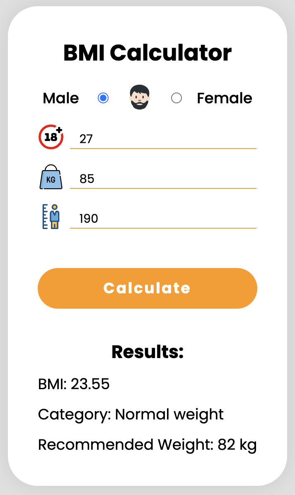

# BMI Calculator

This project is a simple Body Mass Index (BMI) calculator implemented in JavaScript, with a user interface created using HTML and CSS.

# How to Use:

1. Open the index.html file in your web browser.
2. Enter your: gender, age, weight in kilograms and height in meters.
3. Click the "Calculate" button to see your Body Mass Index.

